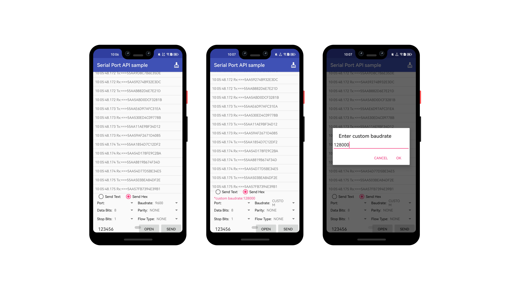

<!--[](https://code.google.com/archive/p/android-serialport-api/)-->
# Android-Serialport
移植谷歌官方串口库[android-serialport-api](https://code.google.com/archive/p/android-serialport-api/),仅支持串口名称及波特率，该项目添加支持校验位、数据位、停止位、流控配置项

跳转到调试界面的起始页 接收调试界面的参数保存代码（保存串口调试界面 参数  方便其他模块直接读取参数  初始化链接 ，仅限只有一个串口设备的情况，如果有 ≥2串口设备同时运行 ，则不可以这样做）
```
         if (data != null) {
                        val port = data.getStringExtra("port")
                        val baudrate = data.getIntExtra("baudrate", 0)
                        val databits = data.getIntExtra("databits", 0)
                        val parity = data.getIntExtra("parity", 0)
                        val stopbits = data.getIntExtra("stopbits", 0)
                        val flowcon = data.getIntExtra("flowcon", 0)


                        MmkvUtil.save(MmkvUtil.Port, port);
                        MmkvUtil.save(MmkvUtil.Baudrate, baudrate);
                        MmkvUtil.save(MmkvUtil.Databits, databits)
                        MmkvUtil.save(MmkvUtil.Parity, parity)
                        MmkvUtil.save(MmkvUtil.Stopbits, stopbits)
                        MmkvUtil.save(MmkvUtil.Flowcon, flowcon)

                        /*MmkvUtil.save(MmkvUtil.port_index, data.getIntExtra(MmkvUtil.port_index, 0))
                        MmkvUtil.save(MmkvUtil.bote_index, data.getIntExtra(MmkvUtil.bote_index, 0))
                        MmkvUtil.save(MmkvUtil.paruty_index, data.getIntExtra(MmkvUtil.paruty_index, 0))
                        */

                        tv_serialinfo?.text = getSerialInfo();

                        TipDialog.show("保存成功")
                    } else {
                        TipDialog.show("串口数据空")
                    }

```
<!---->


[](https://github.com/xmaihh/Android-Serialport/network)[](https://github.com/xmaihh/Android-Serialport/issues)[](https://github.com/xmaihh/Android-Serialport/stargazers)[](https://github.com/xmaihh/Android-Serialport/search?l=C)[](https://bintray.com/xmaihh/maven/serialport)
[](https://github.com/xmaihh/Android-Serialport)

# 文档

<p >
    <a href="https://github.com/xmaihh/Android-Serialport/blob/master/README.md">中文</a>
    | <a href="https://github.com/xmaihh/Android-Serialport/blob/master/README_EN.md">English</a>
</p>

# 使用依赖
1. 在项目根目录的`build.gradle`文件中添加：
```
allprojects {
    repositories {
        ...
        mavenCentral()
    }
}
```
2. 在项目Module下的`build.gradle`文件中添加：
```
dependencies {
    implementation 'io.github.xmaihh:serialport:2.1.1'
}
```
# 属性支持
| 属性 |                                                                  参数                                                                  |
| --- |:------------------------------------------------------------------------------------------------------------------------------------:|
|波特率 | [BAUDRATE](https://github.com/xmaihh/Android-Serialport/blob/master/serialport/src/main/java/android_serialport_api/SerialPort.java) |
|数据位 |                                                            5,6,7,8 ;默认值8                                                             |
|校验位 |                                   无奇偶校验(NONE), 奇校验(ODD), 偶校验(EVEN), 0校验(SPACE), 1校验(MARK); 默认无奇偶校验                                   |
| 停止位|                                                              1,2 ;默认值1                                                               |
|流控 |                                         不使用流控(NONE), 硬件流控(RTS/CTS), 软件流控(XON/XOFF); 默认不使用流控                                          |
# 代码功能
## 1.列出串口列表
```
serialPortFinder.getAllDevicesPath();
```
## 2.串口属性设置
```
serialHelper.setPort(String sPort);      //设置串口
serialHelper.setBaudRate(int iBaud);     //设置波特率
serialHelper.setStopBits(int stopBits);  //设置停止位
serialHelper.setDataBits(int dataBits);  //设置数据位
serialHelper.setParity(int parity);      //设置校验位
serialHelper.setFlowCon(int flowcon);    //设置流控
```
[](https://github.com/xmaihh/Android-Serialport)

串口属性设置需在执行`open()`函数之前才能设置生效
## 3.打开串口
```
serialHelper.open();
```
## 4.关闭串口
```
serialHelper.close();
```
## 5.发送
```
serialHelper.send(byte[] bOutArray); // 发送byte[]
serialHelper.sendHex(String sHex);  // 发送Hex
serialHelper.sendTxt(String sTxt);  // 发送ASCII
```
## 6.接收
```
 @Override
protected void onDataReceived(final ComBean comBean) {
       Toast.makeText(getBaseContext(), new String(comBean.bRec, "UTF-8"), Toast.LENGTH_SHORT).show();
   }
```
## 7.粘包处理
支持粘包处理,原因见[issues#1](https://github.com/xmaihh/Android-Serialport/issues/1),提供的粘包处理有
1. [不处理](https://github.com/xmaihh/Android-Serialport/blob/master/serialport/src/main/java/tp/xmaihh/serialport/stick/BaseStickPackageHelper.java)(默认)
2. [首尾特殊字符处理](https://github.com/xmaihh/Android-Serialport/blob/master/serialport/src/main/java/tp/xmaihh/serialport/stick/SpecifiedStickPackageHelper.java)
3. [固定长度处理](https://github.com/xmaihh/Android-Serialport/blob/master/serialport/src/main/java/tp/xmaihh/serialport/stick/StaticLenStickPackageHelper.java)
4. [动态长度处理](https://github.com/xmaihh/Android-Serialport/blob/master/serialport/src/main/java/tp/xmaihh/serialport/stick/VariableLenStickPackageHelper.java)
支持自定义粘包处理，第一步实现[AbsStickPackageHelper](https://github.com/xmaihh/Android-Serialport/blob/master/serialport/src/main/java/tp/xmaihh/serialport/stick/AbsStickPackageHelper.java)接口
```
/**
 * 接受消息，粘包处理的helper，通过inputstream，返回最终的数据，需手动处理粘包，返回的byte[]是我们预期的完整数据
 * note:这个方法会反复调用，直到解析到一条完整的数据。该方法是同步的，尽量不要做耗时操作，否则会阻塞读取数据
 */
public interface AbsStickPackageHelper {
    byte[] execute(InputStream is);
}
```
设置粘包处理
```
serialHelper.setStickPackageHelper(AbsStickPackageHelper mStickPackageHelper);
```
* 其实数据粘包可参考socket通讯的粘包处理,例如此处粘包处理方法出自于[XAndroidSocket](https://github.com/Blankeer/XAndroidSocket)

# 屏幕截图



<a href="https://play.google.com/store/apps/details?id=com.ex.serialport"></a>

PC端调试工具 [友善串口调试工具](https://github.com/xmaihh/Android-Serialport/raw/master/serial_port_utility_latest.exe)

# 更新日志
## [2.1.2](https://github.com/xmaihh/Android-Serialport/tree/v2.1.2)
### 新增
- 添加支持设置校验位:0校验(SPACE)、1校验(MARK)
- 添加支持设置自定义波特率 见[issues#26](https://github.com/xmaihh/Android-Serialport/issues/26)

## [2.1.1](https://github.com/xmaihh/Android-Serialport/tree/v2.1.1)
### 修复
- 修复引用依赖问题见[issues#17](https://github.com/xmaihh/Android-Serialport/issues/17)
- 迁移到到MavenCentral

## [2.1](https://github.com/xmaihh/Android-Serialport/tree/v2.1)
### 新增
- 添加支持设置接收数据粘包处理，支持设置自定义粘包处理

## [2.0](https://github.com/xmaihh/Android-Serialport/tree/v2.0)
### 新增
- 添加支持设置校验位、数据位、停止位、流控配置项

## [1.0](https://github.com/xmaihh/Android-Serialport/tree/v1.0)
### 新增
- 基础功能,串口设置串口号、波特率,发送、接收数据


# FAQ
* 此library不提供ROOT权限,请自行打开串口`666`权限
```shell
adb shell  chmod 666 /dev/ttyS1
```
